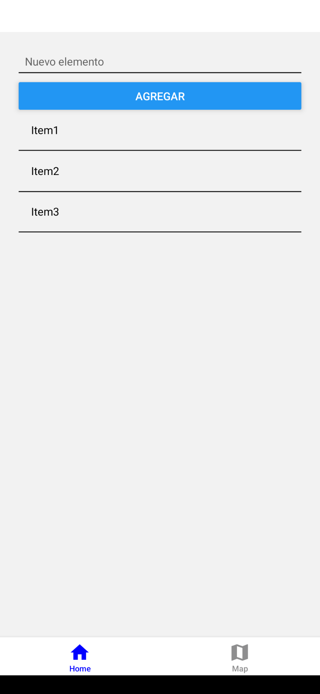
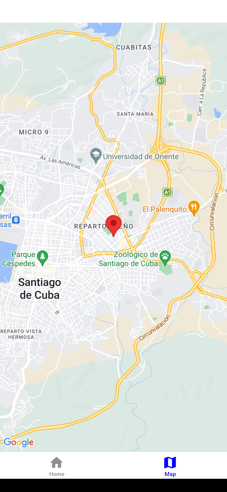
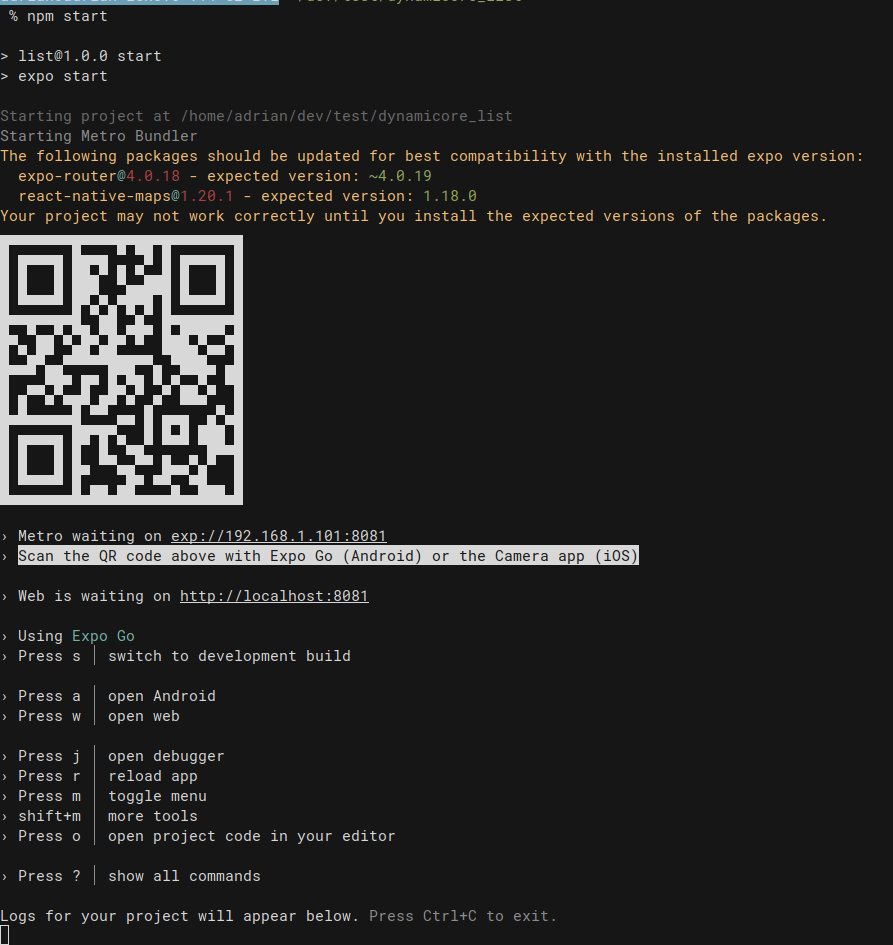

# Dynamicore React Native Test

## Table of contents

- [Overview](#overview)
  - [The challenge](#the-challenge)
  - [Screenshot](#screenshot)
  - [Links](#links)
- [My process](#my-process)
  - [Built with](#built-with)
- [Install](#install)
- [Author](#author)

## Overview

### The challenge

Create a simple React Native app that displays a list of items and allows you to add new items using a form.
Implement a React Native component that displays a map with the user's current location.

### Screenshot

### Links

- Solution URL: [Solution URL](https://github.com/adrianburgoscolas/dynamicore_list)

## My process

### Built with

- [Expo](https://expo.dev/) - A framework to create universal native apps with React that run on Android, iOS, and the web. Iterate with confidence
- [TypeScript1](https://www.typescriptlang.org/) - TypeScript is a strongly typed programming language that builds on JavaScript
- Semantic HTML5 markup

## Install

- Clone repository `git clone git@github.com:adrianburgoscolas/dynamicore_list.git`
- Go to project folder `cd dynamicore_list`
- Install dependencies `npm install`
- Start project `npm start`

- Download the app from the Google Play Store, or visit the Expo Go page on the [Google Play Store](https://play.google.com/store/apps/details?id=host.exp.exponent&referrer=docs).
- Scan the QR code above with Expo Go (Android) or the Camera app (iOS)

## Author

- Website - [Adrian Burgos: Portfolio](https://adrianburgoscolas.github.io/portfolio/)
- GitHub - [https://github.com/adrianburgoscolas](https://github.com/adrianburgoscolas)
- LinkedIn - [Adrian Burgos Web Developer](https://www.linkedin.com/in/adrian-burgos-1776a6144/)
